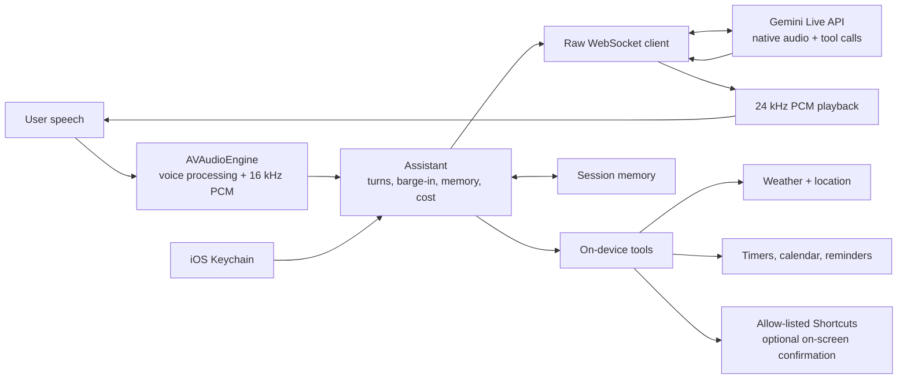

# Atlas for iPhone

Atlas is a Turkish-first, speech-to-speech iPhone assistant built directly on the Gemini Live API.

## What it is

- A native Swift client that sends 16 kHz PCM audio to Gemini Live over a raw WebSocket and plays 24 kHz PCM responses, without an STT/TTS cascade or client SDK.
- A tool-using assistant for weather with location, notification-backed timers, device status, calendar, reminders, and explicitly allowed iPhone Shortcuts.
- A full-duplex voice interface with barge-in, echo cancellation through iOS voice processing, and background audio so a conversation can continue with the screen locked.
- A Turkish-first system with optional Jev pre-routing, session memory, configurable context limits, and measured cost tracking.
- A Mac-free build: XcodeGen defines the project, GitHub Actions produces unsigned IPAs, and the user signs and sideloads them with their own Apple ID.

## Architecture

The app owns the audio session and connection lifecycle in `Assistant`. `LiveClient` implements the Gemini wire protocol with `URLSessionWebSocketTask`; API keys are supplied at runtime from Keychain. Tool declarations are attached during Live setup, and tool results return through the same socket.

The direct mode lets Gemini choose tools. The experimental pre-routing mode runs a parallel live transcription, asks Jev whether a tool is needed, and sends Gemini a short hint while leaving execution with the normal tool layer.

## Evaluation & measurements

The shared desktop evaluation is the controlled baseline for the routing design used here: 34 Turkish cases, including 8 traps where no tool should be called, with a fresh session for every case and mutating tools run dry.

| Measurement | Direct mode | Two-step Jev mode |
| --- | ---: | ---: |
| End-to-end accuracy | **33/34 (97%)** | 31/34 (91%) |
| Trap accuracy | **100%** | **100%** |
| Jev selection when called | — | **24/24 (100%)** |
| Standalone Jev selection | — | **68/68** |
| First-audio median / p95 | **1.72 s / 2.44 s** | 2.55 s / 5.07 s |
| First audio on tool turns | **1.77 s** | 2.84 s |
| Gemini text tokens per case | **1,419** | 1,722 (+21%) |
| Gemini cost for 34 cases | **$0.146** | $0.185 (+27%) |
| Jev overhead | — | 385 ms median; $0.0007 / 24 calls |

Jev itself selected correctly every time it was called, but the extra Live turn increased both latency and token use. The hypothesis that a pre-router would shrink context and cost was **disproved** by measurement, so direct mode remains the default.

A later voice pre-routing experiment found that a short hint worked 8/8 times. Speculatively asking Jev after the interim transcript settled was 5/5 accurate and reduced first audio from 3.3 s to 2.5 s, still slower than the 2.2 s direct voice baseline.

Billing probes also established that Gemini Live bills the whole accumulated context on every turn, while silence is not billed. An 8k sliding context cap reduced the projected hourly cost by roughly **7×** (about 1,640 TRY to 230 TRY for the measured continuous-conversation scenario).

Two iOS integration constraints are handled explicitly:

- Google Search combined with 8k context compression produced WebSocket close code 1007; search therefore forces a context limit of at least 16k.
- Search on the tested free tier produced close code 1011 for quota, and a message sent before Live setup completed produced 1007. The client queues non-audio messages until `setupComplete` and can disable search after a quota failure.

## Safety & privacy by design

- Gemini, TypeSafe, and optional GitHub credentials are entered in the app and stored in the iOS Keychain with this-device-only accessibility; no secret is embedded in source or an IPA.
- Shortcuts are exposed to the model only through a user-maintained allow-list. Each entry can require an on-screen confirmation before it runs.
- iOS permission prompts gate microphone, location, calendar, reminders, and notifications.
- The Jev usage ledger refuses further selector calls when its fixed USD budget is exhausted; Gemini usage is calculated from returned token metadata and shown in TRY.
- Logs deliberately omit API keys, and generated projects, builds, and IPA files are ignored by source control.

## Build and sideload

The repository is designed to build without a local Mac:

1. Push a revision or manually run the `build-ipa` GitHub Actions workflow.
2. The macOS runner installs XcodeGen and generates `Atlas.xcodeproj` from `project.yml`.
3. Xcode builds the `Atlas` and `AtlasProbe` schemes with code signing disabled.
4. The workflow packages the apps as unsigned `Atlas.ipa` and `AtlasProbe.ipa` files and uploads them as the `ipa` artifact.
5. Download the IPA and use a sideloading tool such as SideStore or iLoader to sign it with your own Apple ID and install it on your iPhone.

After installation, enable Developer Mode if iOS requests it, grant only the permissions you want to use, and enter API credentials in the app's Settings screen. A free Apple ID may require periodic re-signing; that behavior belongs to Apple's provisioning rules, not Atlas.

`AtlasProbe` is a small companion target that tests background microphone capture and the Shortcuts callback round trip independently of the main assistant.

## Status and limitations

Atlas is a personal, experimental project rather than a production service.

- Prompts, tool names, and evaluation cases are primarily Turkish.
- Jev pre-routing and Google Search are experimental modes; direct tool selection is the measured default.
- Search needs a billed Gemini project and at least a 16k context window in the tested setup.
- Background audio permits lock-screen operation, but iOS permissions, interruptions, provisioning, and network conditions still apply.
- Calendar, reminder, location, notification, and Shortcut features depend on the permissions and configuration present on the phone.
- Live audio costs can grow with conversation history because the entire retained context is billed again each turn; the context cap is therefore a practical cost-control feature.
- The GitHub Actions output is unsigned and must be signed by the user before installation.

## Related repositories

- iPhone client: [f23783/atlas-ios](https://github.com/f23783/atlas-ios)
- Desktop sibling: [f23783/atlas-live](https://github.com/f23783/atlas-live)

## License

MIT — see [LICENSE](LICENSE).
